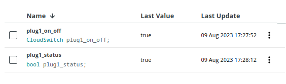
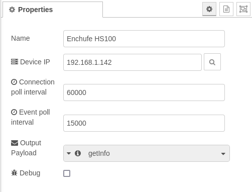
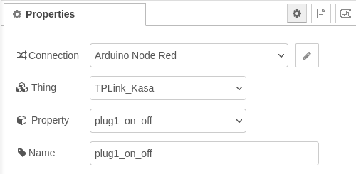
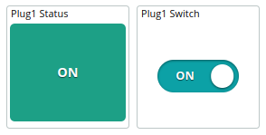

arduino-cloud-tplink-plug-nodered
===================================

This project shows how to control and monitor TP-Link smart plugs using Arduino Cloud and Node-RED.

# Introduction
We're surrounded by systems in our homes that help us control and manage our environment. From controlling the heating system and monitoring the temperature to managing the lights and more, these systems make our lives easier. 

While we can control most of these systems through PC or mobile apps, they are usually locked-in and it can get sometimes not practical to have multiple applications. That's where an integrated platform comes in, offering a centralized hub for all our customized dashboards.

But additionally, sometimes, we want to combine data from different applications to trigger actions on other systems. And if you're an Arduino enthusiast like me, you'd want to integrate all of it with your Arduino projects. 

Arduino Cloud is an excellent solution for that, but integrating external platforms can be a bit tricky, especially with many commercial products lacking direct integration. That's where Node-RED comes to the rescue! It helps us redirect and manage the traffic between these commercial products and Arduino Cloud. 

This project is part of a series that I've created to showcase how I manage my home systems by integrating them with Arduino Cloud. In addition to this project, I've also worked on integrating [Tuya Energy meters](https://github.com/dbduino-prjs/arduino-cloud-tuya-energy-nodered) and [Honeywell Evohome heating system](https://github.com/dbduino-prjs/arduino-cloud-evohome-nodered), so you can check those out too! 

## What are TP-Link smart plugs and Kasa?
[TP-Link Smart Wi-Fi Plugs](https://www.tp-link.com/es/home-networking/smart-plug/) are devices designed to make your everyday appliances and electronics smarter by allowing you to control them remotely through your Wi-Fi network. These plugs are part of TP-Link's smart home ecosystem, designed to provide more convenience and control over your devices. 

[Kasa](https://www.tp-link.com/es/kasa-smart/kasa.html) is the platform developed by TP-Link to manage and control these smart devices through a user-friendly app, allowing you to remotely control, schedule, and automate your connected devices for added convenience and efficiency. It provides an API which is very convenient to integrate these devices with other platforms.

## What is Arduino Cloud?
[Arduino Cloud](https://cloud.arduino.cc) is a platform that simplifies the process of developing, deploying, and managing IoT devices. It supports various hardware, including Arduino boards, ESP32, and ESP8266 based boards, and makes it easy for makers, IoT enthusiasts, and professionals to build connected projects without coding expertise. 

The platform's IoT Cloud tool allows for easy management and monitoring of connected devices through customizable dashboards, which provide real-time visualisations of the device's data. The dashboards can be accessed remotely through the mobile app Arduino IoT Cloud Remote, which is available for both Android and iOS devices, allowing users to manage their devices from anywhere.

## What is Node-RED?
[Node-RED](https://nodered.org/) is an open-source visual programming tool designed for connecting and automating devices, services, and APIs. It provides a browser-based flow editor that allows users to create flows by dragging and dropping nodes onto a canvas and connecting them together. Each node represents a specific functionality or service, such as data input/output, data transformation, or communication with external systems. With its intuitive interface and extensive library of pre-built nodes, Node-RED enables users to quickly and easily create complex workflows without the need for traditional coding. It is particularly popular in the Internet of Things (IoT) domain, where it simplifies the integration of various sensors, devices, and cloud services, allowing users to build powerful IoT applications and automation systems.

# Pre-requisites
You need:
* a TP-Link smart WIFI plug like the [HS100](https://www.tp-link.com/es/home-networking/smart-plug/hs100/)
* The Kasa app installed in your mobile phone
* an Arduino Cloud account (https://cloud.arduino.cc)
* an instance of Node-RED (running on a local or Cloud machine). You can find more information about how to install Node-RED [here](https://nodered.org/docs/getting-started/local).

You don't need:
* any Arduino, ESP32 or ESP8266 devices

# The process 
1. Configure your TP-Link smart plug 
2. Create the Device and Thing in the Arduino Cloud
3. Create the Node RED flow 
4. Create the Arduino Cloud Dashboard 
5. Test everything 

## 1. Configure your TP-Link smart plug
The goal is to add your TP-Link smart plug to the Kasa app in your mobile phone. This process connects the device to your WIFI network and internet. 
You can find the instructions in a leaflet in your smart plug box or in the [support page](https://www.tp-link.com/es/support/download/hs100/).

> Note: If you are using a different smart plug, you will need to locate the right instructions

Note down the IP address of your device.

## 2. Create the Device in the Arduino Cloud
### Create the Device 
Go to the [Devices](https://create.arduino.cc/iot/devices) section of the Arduino IoT Cloud and click on **ADD**. 
Select **Any Device** and follow the instructions on the wizard.

> Note: Save your `Device ID` and `Secret Key`. We are not going to use them (as we will use the API key), but it can be helpful for other use cases.

### Create the Thing 
In the Devices list, find the device you just created and click on **CREATE THING** and assign a name to it.

### Create the Variables 
Add the variables clicking on the ADD button. At the end of the process, your list of variables should look like this.

| Name                | Type       | Description |
|---------------------|------------|-------------|
| plug1_on_off        | STATUS     | Action to be executed on the plug |
| plug1_status        | STATUS     | Plug status |

> Note: All the variables have to be READ-WRITE. You can define the periodicity you wish or set them with the policy ON-CHANGE.

This is a screenshot for reference.

### Get an Arduino Cloud API key
- Go to https://cloud.arduino.cc/home/api-keys.
- Click on **CREATE API KEY**, enter a name.

Note down the Client ID and Client Secret or download the PDF. We will use these credentials in the Node-RED node.

## 3. Create the Node-RED flow
Access your Node-RED instance (typically `http://<YOUR_IP>:1880`) and import the code:
1. Select `Import` in the menu
   - Paste the code that you can find in [flows.json](https://raw.githubusercontent.com/dbduino-prjs/arduino-cloud-tplink-plug-nodered/master/flow.json) in the github project
   - Click on `Import`
2. Configure the Kasa nodes 
   - You have to introduce the IP address of your TP-Link smart switch. You can either introduce it manually or click on the `Search` button to search for local devices

> Note: You can adjust your configuration to your needs. For instance, you could leave Device IP empty so that you use the platform directly

3. Configure the Arduino Cloud nodes
   - Configure your connection with the Arduino Cloud API key that you created in the previous section  
   - Introduce your Thing and property

4. Click on **Deploy** (top right corner of the screen)

## 4. Create the Arduino Cloud dashboard
Go to the Dashboards section and click on **CREATE**. 
You can add the widgets as you wish. Here you have a screenshot of mine as a reference:

## 5. Let's test the system
And that's it.
Now it is time to go to your Arduino Cloud dashboard, see the status of your plug and control it with the button.
